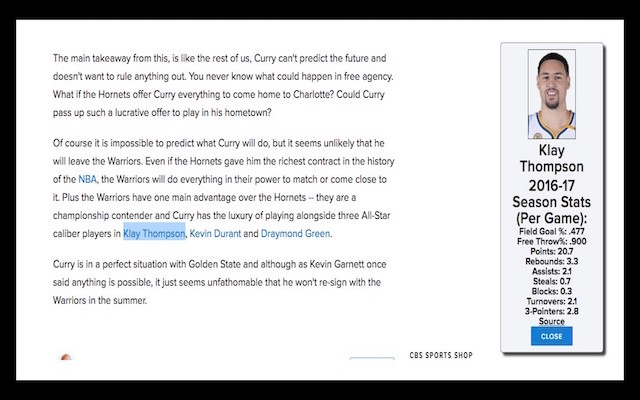

# NBA Basketball Season Stats Chrome Extension

[Extension live][chrome]

[chrome]: https://chrome.google.com/webstore/detail/nba-fantasy/mpcaiajpmmiealhpeoipjmkodgijmccm

**This is a chrome extension that allows users to pull up a current NBA player's season stats on any web page without needing to redirect to a dedicated webpage.
To look up a player, select a player's name in text on the webpage, right-click the selection, and select the extension command. This will append a div element to the right side of the page that will fetch the player's data. If you select a different player on the same page afterward, it will delete the first div and replace it.

#UPDATE 7/10/2017:
My original extension web-scraped from basketball-reference.com. One of the key weaknesses that I did not foresee was that because my source did not have an SSL certificate, the extension would fail to work on secure websites, which represents a significant portion of the web.

I have since found a replacement API with an SSL certificate in data.nba.net.

There were two major trade-offs of switching data sources:
  ### Unlike basketball-reference.com, one could not simply parse a player's name into the API to make the corresponding GET request. Players are identified by arbitrary 6 or 7 digit playerIds when making calls to the API, and this necessitated creating a rather large hash map mapping player names to their IDs. For example, to access Stephen Curry's 2016-17 season stats, one would make an API call to https://data.nba.net/10s/prod/v1/2017/players/201939_profile.json

  As this is a large task (the NBA has ~400 active players and new players are drafted and signed each year), for now I listed ESPN's top 100 current season players, since they are the ones most likely to be searched.
  ### The API did not provide player images.

## Features

### Easy Installation
- Simply click on 'Add extension' in the installing page(link above)!

### Provide Definitions

- Allows users to pull up player stats on the fly.

## Additional Features to be Added

- Allow users to select options to select which stats to pull
